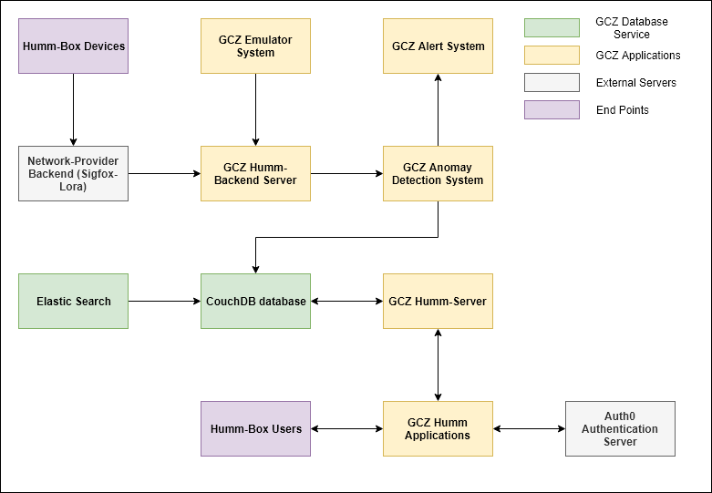

# GCZ Documentation

> GCZ system is the end-to-end IoT system from IoT devices to end-users. The raw data collected from GCZ devices is processed, analyzed to produce the high-level information, also known as usable knowledge, to the end-users. Based on this knowledge, they could have the correct and timely decisions which gain a massive economic benefits.    

 
*The overview of GCZ eco-systems*

In general, the GCZ eco-system includes IoT applocations deployed on AWS environment, database services (storage, indexing service) and external services (3rd party services).
As we can see in the above figure:
* GCZ Application: These applications are used to process the data and provide the access to these data via Web services.
* GCZ Database services: We use these services to store the data and make it effectively findable by using an indexing service.
* GCZ External service: To authenticate and manage the user access right, we integrate the Auth0 service into GCZ system.
* new line 

