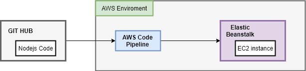
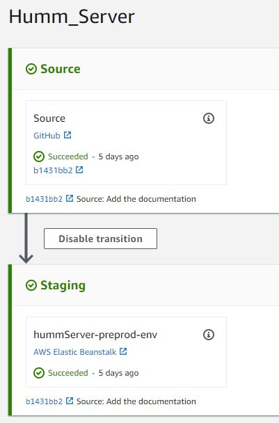

# Amazon Components Tutorial
This is a basic toturial to show how to connect and use the Aws Component of GCZ.

## Overview

All of the GCZ Applications are Nodejs Application deployed on AWS environment. In this tutorial, we review the basic AWS components and deploying procedure that are used to deploy the Nodejs Applications on AWS.

 
*The overview of deploying NodeJS Application from GIT to AWS*

As shown in the figure, we have 3 components: 
* [Git Hub](https://github.com/): This is code storage.
* [Elastic Beanstalk](#aws-elastic-beanstalk): This operates as an application container which maintains an application running on a virtual machine, namely EC2 Instance. 
* [AWS Code Pipeline](#aws-code-pipeline): This component acts as a bridge between GIT and Beanstalk. Its main responsibility is to obtain the code from GIT and deployed to Beanstalk

## AWS Code Pipeline

We use AWS Code Pipeline to check for code changes in the Git Hub and then build and deploy to Elastic Beanstalk. The main steps to create a code pipeline are:
* Source Stage: It connects to the GitHub repository and tracking the changes of source code. When there is a commit, this stage triggers the code pipeline and provides the output artifact from the Source Code.
* Staging State: The output artifact from the previous step is ingested as an input artifact of this stage to deploy to Elastic Beanstalk.

 
*A example of Code Pipeline Configuration*

We can access the Code Pipeline Management Page at this URL
```sh
[https://eu-central-1.console.aws.amazon.com/codesuite/codepipeline/pipelines?region=eu-central-1]
````

## EC2 services:
Amazon Elastic Compute Cloud (Amazon EC2) manages the AWS servers that are renting to run Appications, Database....

### Access the EC2 monitoring page

We can do the monitoring and simple operations (restart, shutdown) on the EC2 instances at this URL
```sh
[https://eu-central-1.console.aws.amazon.com/ec2/v2/home?region=eu-central-1#Instances:sort=instanceId]
````
A step-by-step tutorial is also found at
```sh
[https://blog.bitsrc.io/setting-up-blue-green-deployment-for-your-application-in-aws-ecs-using-code-pipeline-90a5a5551d93]
````

### Create an EC2 Instance

To connect directly to an EC2 Instance, you can follow this instruction:
```sh
https://docs.aws.amazon.com/quickstarts/latest/vmlaunch/step-1-launch-instance.html
````

### Access an EC2 Instance

To connect directly to an EC2 Instance, you can follow this instruction:
```sh
https://docs.aws.amazon.com/quickstarts/latest/vmlaunch/step-2-connect-to-instance.html
````
The secret key is used in this tutorial is provided in the email. 


## AWS Elastic Beanstalk

We use AWS Elastic Beanstalk (AWS-EB) to create, view, deploy, and update our applications (humm-server, humm-backend) to AWS. Note that: When we creat an AWS Elastic Beanstalk, a [EC2 instance](#EC2-servicesr) is also created to host this application. 

### Access the AWS-EB

We access the administration page of AWS-EB at this URL:
```sh
https://eu-central-1.console.aws.amazon.com/elasticbeanstalk/home?region=eu-central-1#/applications
````

### Create the EB applications.

We can create an application on EB following this instruction. Note that: after creating, this application is an empty application running on the AWS sample code. We need to used AWS Code-pipeline to deploy our code to this application.

```sh
https://docs.aws.amazon.com/elasticbeanstalk/latest/dg/GettingStarted.html?icmpid=docs_elasticbeanstalk_console#GettingStarted.Walkthrough.CreateApp
````

### Change the EB applications configuration

We can change the basic configuration fo EB-application (such as the size of EC2 instance) based on this instruction:

```sh
https://docs.aws.amazon.com/elasticbeanstalk/latest/dg/GettingStarted.html?icmpid=docs_elasticbeanstalk_console#GettingStarted.Walkthrough.EditConfig
````


    

